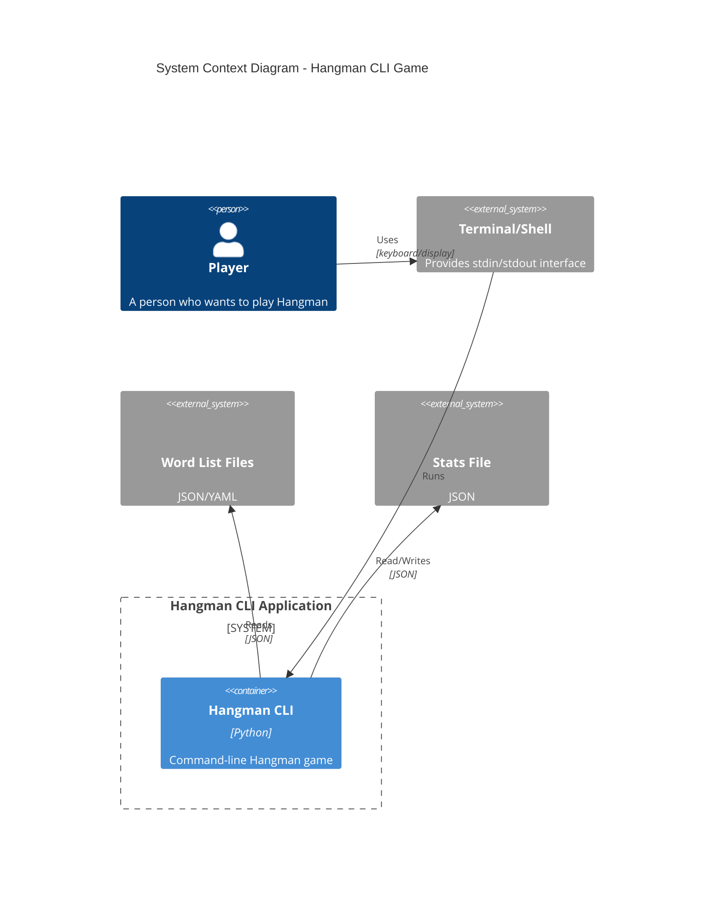
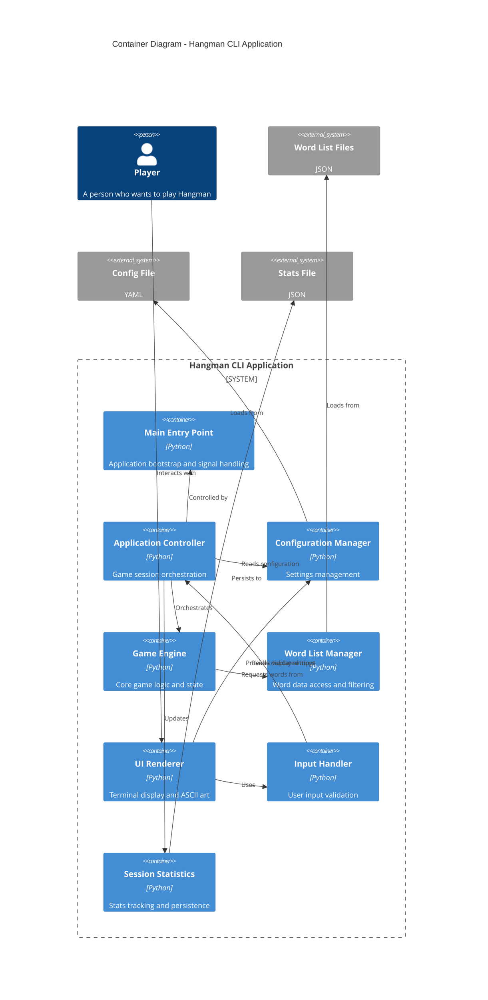
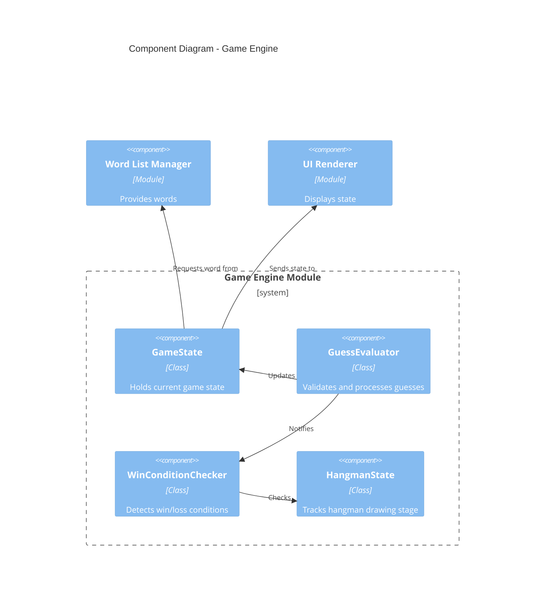
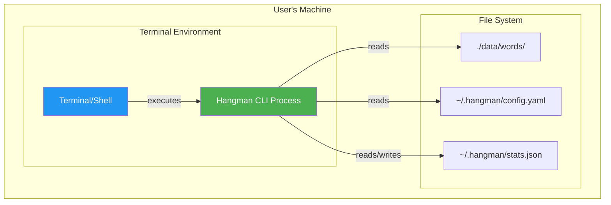

# Hangman CLI - Component Diagram

## System Context (C4 Level 1)

## Container Diagram (C4 Level 2)

## Component Diagram - Game Engine

## Deployment Diagram

---

*Created: 2026-03-08*
*Author: System Architect*
